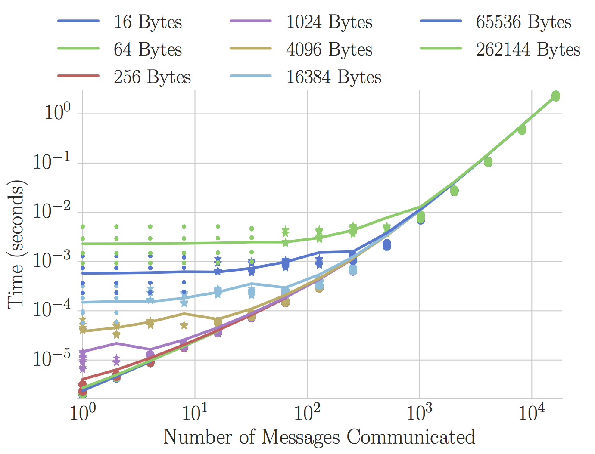
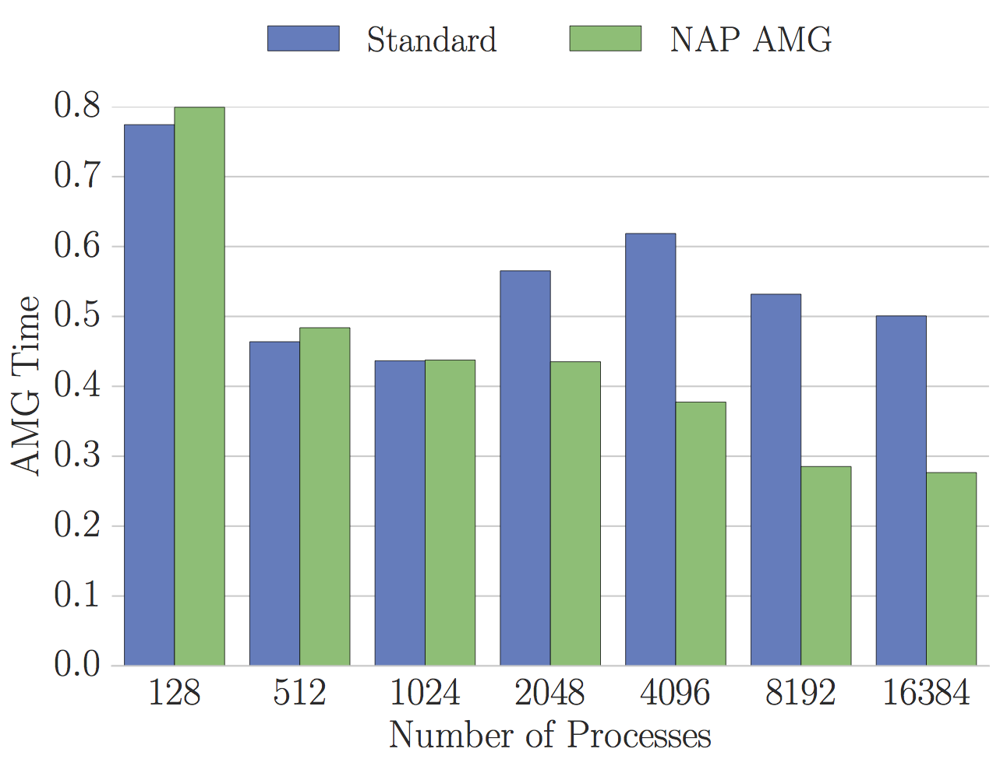
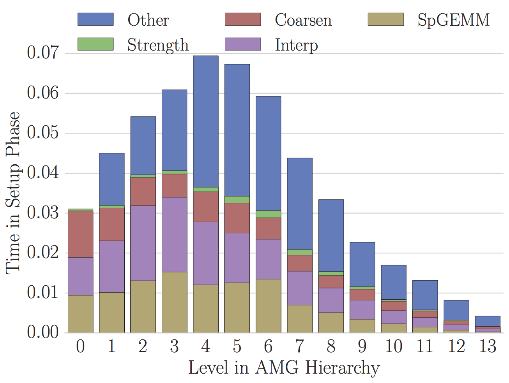
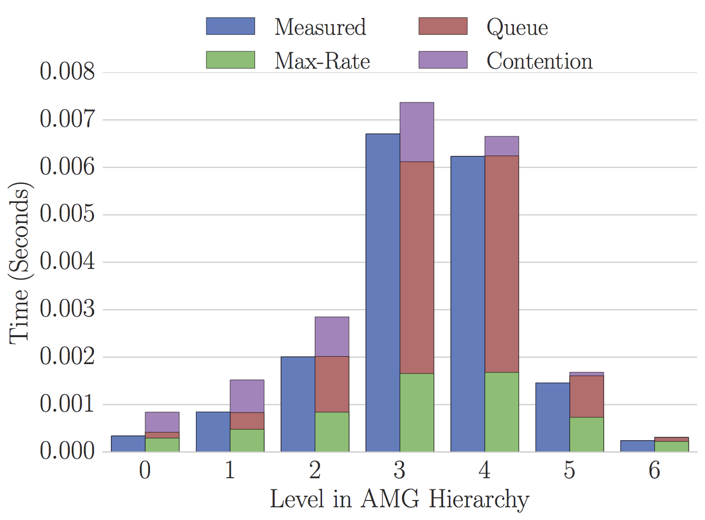

## PyFancyPlots
Does your advisor enjoy fancy plots?  Is his name Luke?  Then this plotting script is for you!

## Overview
Python plotting tool with default options to make plots easy to read.  This
script uses matplotlib and Seaborn.  

## Testimonials
"That plot looks great." -- Luke

## Plotting Examples
Import `plot.py' for default plotting parameters to be set.  A few important
methods:
    - The method add_anchored_legend will add a multicolumn legend above your
      plot.  Examples of this are in the plots below.
    - The method save_plot will save your figure with settings preferred by Luke
    - The methods stacked_barblot and partially_stacked_barplot create Seaborn
      barplots by stacking your data (or some of it for you).  

## Example Line Plot
Default and Luke-recommended settings are displayed in a simple line and scatter
plot below.  Make sure to call add_luke_options() and save_plot(...) to add
these settings to your figures. 

## Standard and Stacked BarPlots
The standard and stacked bar plots (available in methods barplot(...) and
stacked_barplot(...)) take a typical list of x_data and either a
single list or list of lists for y_data.  If y_data is a list of lists, a list
of corresponding labels is also required.  Each list of y_data will be plotted
at all x_data positions, as shown below.

## Partially Stacked BarPlot
The previous standard and stacked barplots can also be combined with method
partially_stacked_barplot(...).  This method takes x_data as usual, and then a
list of y_data.  The list for y_data contains both y_data lists and lists of
lists.  E.g. y_data = [y0, y1, [y2, y3], y4, [y5, y6]] will plot y0, y1, and y4
as normal barplots, while y3 will be stacked on top of y2, and y6 will also be
stacked on y5.  Correpsonding labels should be in the same format as y_data.

